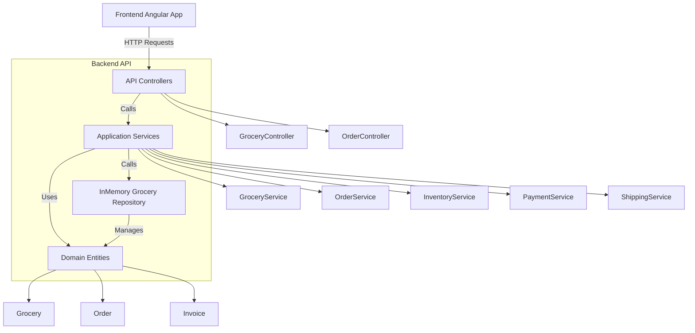

# System Diagram for eg-shop

This diagram illustrates the main components of the eg-shop system and their interactions.

- **Frontend Angular App**: The client application that interacts with the backend API.
- **API Controllers**: Expose REST endpoints (e.g., GroceryController, OrderController).
- **Application Services**: Contain business logic (e.g., GroceryService, OrderService, InventoryService, PaymentService, ShippingService).
- **Domain Entities**: Core data models (e.g., Grocery, Order, Invoice).
- **Repository**: Data access layer, currently implemented as an in-memory repository for groceries.

